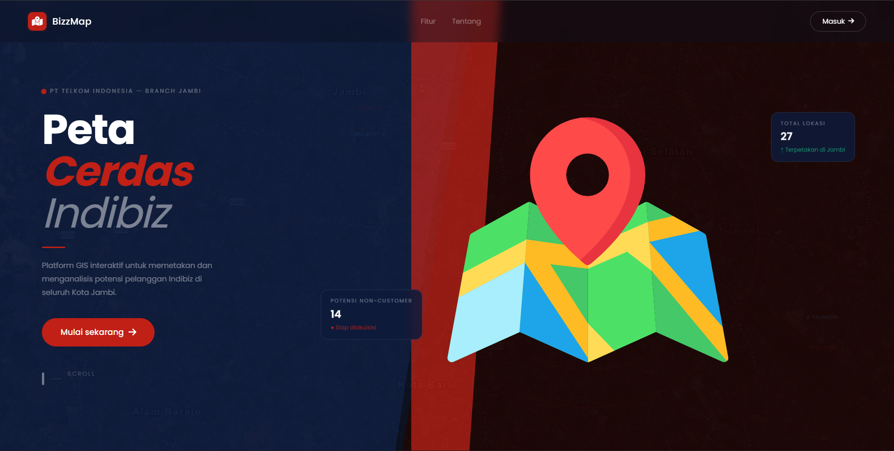
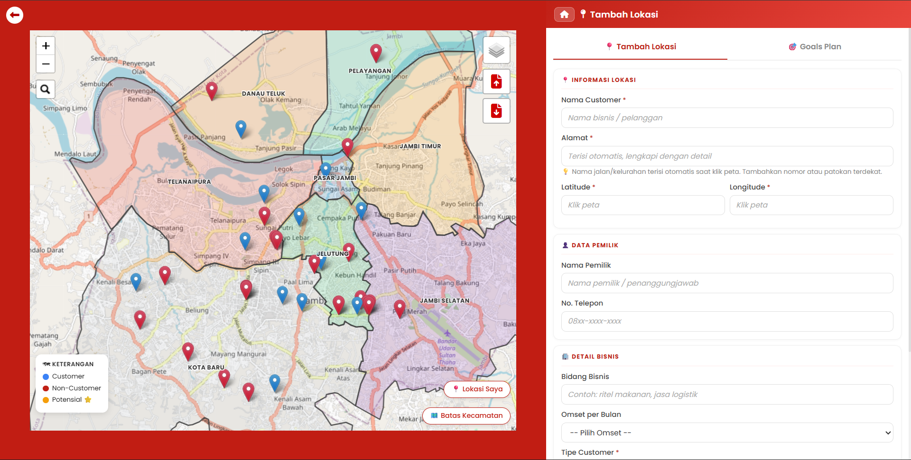
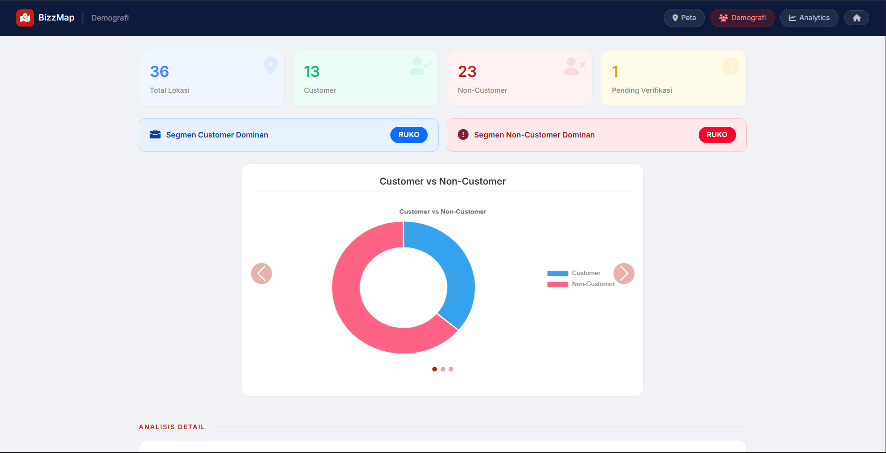
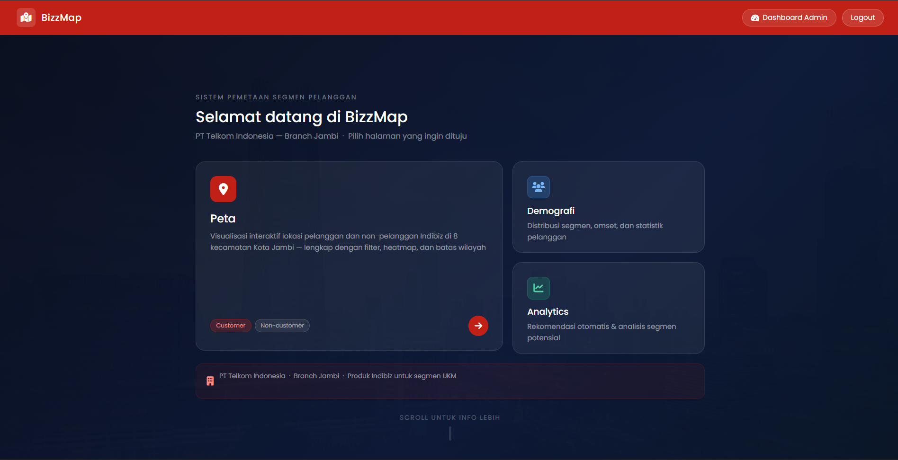

<div align="center">

# 🗺️ BizzMap

**GIS Platform for Indibiz Customer & Non-Customer Segment Mapping**

PT Telkom Indonesia — Branch Jambi

[](https://laravel.com)
[](https://leafletjs.com)
[](https://getbootstrap.com)
[](https://www.chartjs.org)
[](https://www.mysql.com)

[Live Demo](https://bizzmap.web.id) · [Report Bug](https://github.com/Adeebs11/bizzmap/issues)

</div>

---

## 📌 About

**BizzMap** is a web-based GIS application built to help PT Telkom Indonesia's sales team map, track, and analyze **Indibiz** customer and non-customer segments across 8 districts in Jambi City. It combines interactive mapping, real-time GPS integration, and data-driven analytics into a single tool designed for field teams.

Built with **Extreme Programming (XP)** methodology across three iterations — from core authentication to advanced data visualization.

---

## ✨ Showcase

### Landing Page
Split-diagonal hero with a Lottie-powered location animation, editorial typography, and floating data cards.



### Interactive Map
Full-featured Leaflet map with marker clustering, heatmap, district boundaries, GPS "My Location," and automatic reverse geocoding.



### Demographics Dashboard
Real-time charts covering customer segment distribution, revenue ranges, subscription packages, and conversion/churn trends.



### Navigation Hub
A hover-animated menu connecting Map, Demographics, and Analytics — each card reveals contextual background animation on interaction.



---

## 🚀 Key Features

| Feature | Description |
|---|---|
| 🗺️ **Interactive Mapping** | Marker clustering, heatmap, fullscreen mode, location search, mini-map, and distance measurement |
| 📍 **GPS Integration** | One-tap "My Location" with real-time accuracy radius and automatic reverse geocoding via Nominatim |
| 🏘️ **District Boundaries** | Manually mapped GeoJSON boundaries for all 8 districts in Jambi City |
| 🧭 **Duplicate Detection** | Haversine-based proximity check (50m radius) to prevent duplicate location entries |
| 📊 **Demographic Analytics** | Segment distribution, revenue breakdown, top subscription packages, and conversion/churn trends with weekly/monthly/6-month filters |
| 🤖 **Auto Recommendations** | Data-driven suggestions per segment based on non-customer potential |
| 🎯 **Potential Marking** | Collaborative flagging of high-potential non-customers, synced across all users |
| ✅ **Data Quality Flags** | Automatic detection of duplicates, suspicious names, and out-of-bounds coordinates before approval |
| 👥 **Role-Based Access** | Three-tier permission system — Admin, Sales Assistant (SA), and Account Representative (AR) |
| 📱 **Mobile Responsive** | Fully optimized map and dashboard views for field use, built with a mobile-first CSS layer |

---

## 🛠️ Tech Stack

**Backend**
- Laravel 11 (PHP)
- MySQL

**Frontend**
- Leaflet.js — interactive mapping
- Chart.js — data visualization
- Bootstrap 5 — layout & components
- Vanilla JS — animations, Lottie integration

**Infrastructure**
- JagoanHosting (shared hosting, cPanel Git deployment)
- Nominatim OpenStreetMap API — reverse geocoding

**Methodology**
- Extreme Programming (XP) — 3 iterations: Authentication → Core Mapping → Data Visualization

---

## 📂 Project Structure

```
bizzmap/
├── app/
│   ├── Http/Controllers/     # Application logic
│   └── Models/                # Eloquent models
├── database/
│   └── migrations/            # Schema definitions
├── public/
│   ├── css/                   # Page-specific stylesheets
│   ├── js/                    # Client-side scripts
│   └── animations/            # Lottie JSON assets
├── resources/
│   └── views/                 # Blade templates
└── routes/
    └── web.php                # Application routes
```

---

## ⚙️ Installation

```bash
# Clone the repository
git clone https://github.com/Adeebs11/bizzmap.git
cd bizzmap

# Install dependencies
composer install
npm install

# Environment setup
cp .env.example .env
php artisan key:generate

# Configure your database in .env, then run:
php artisan migrate

# Serve locally
php artisan serve
```

Visit `http://localhost:8000` to get started.

---

## 👤 User Roles

| Role | Access |
|---|---|
| **Admin** | Full access to all operational pages and user management (Admin/AR/SA) |
| **AR** *(Account Representative)* | Equal access to Admin on all operational pages, except managing Admin/AR accounts (can only manage SA) |
| **SA** *(Sales Assistant)* | Field data entry, map access, and Goals Plan visibility |

---

## 🎓 Academic Context

BizzMap was developed as an undergraduate thesis project for the **Information Systems Program, Universitas Jambi**, in collaboration with PT Telkom Indonesia Branch Jambi.

**Title:** *Rancang Bangun Website Pemetaan Segmen Pelanggan dan Non-Pelanggan PT. Telkom Indonesia Branch Jambi Menggunakan Metode Extreme Programming*

---

## 📄 License

This project is developed for academic purposes. Please contact the author for reuse or collaboration inquiries.

---

<div align="center">

**Adib Yasykur Rizkillah**
Information Systems, Universitas Jambi

</div>
